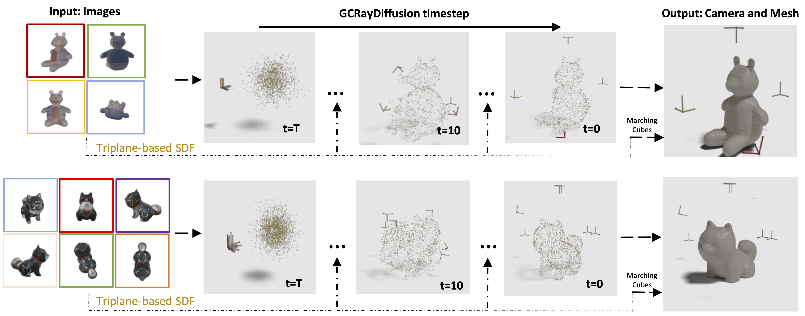

# GCRayDiffusion
> Li-Heng Chen, Zi-Xin Zou, Chang Liu, Tianjiao Jing, Yan-Pei Cao, Shi-Sheng Huang†, Hongbo Fu, Hua Huang

> † Corresponding Author



This repository contains the source code of **GCRayDiffusion:Pose-Free Surface Reconstruction via Geometric Consistent Ray Diffusion** (ICCV 2025)

## Contents (Coming soon)
- [ ] Training Code 
- [ ] Installation Instructions
- [ ] End-to-End Training Demo
- [ ] Coarse and Fine Tuning Instruction

## 🔨 Installation

Clone the repository:
```bash
git clone https://github.com/CountNemoChan/GCRayDiffusion.git
cd GCRayDiffusion
```

Create a conda environment(optional):
```bash
conda create -n gcraydiffusion python=3.9
conda activate gcraydiffusion
```
Install dependencies:
```bash
# pytorch (select correct CUDA version)
pip install torch torchvision --index-url https://download.pytorch.org/whl/{your-cuda-version}

# other dependencies
pip install -r requirements.txt
```
## 💡 Training Steps

### Step 1: Prepare your training dataset

Our training data comes from the open-source dataset Objaverse. Due to the access limitation, I will show you some [sample data](data). You may need to modify the [Dataloader](lrm/data/objaverse.py) later.

### Step 2: Start training

```bash
python launch.py --config configs/training_config.yaml --train --gpu 0
```

Complete details of all training parameters are provided in the [Config_File](configs/training_config.yaml).

### Training Demo

To facilitate training the model on the complete dataset, we provide a training demo to help clarify the training process.

Just run:
```python
python launch.py --config configs/sample_training_config.yaml --train --gpu 0
```
